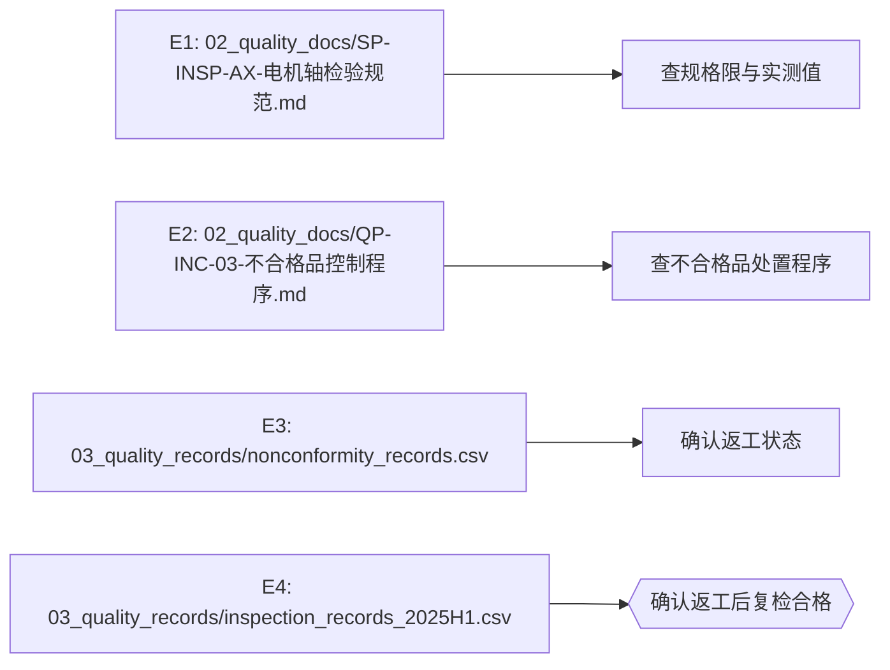

# 决策报告

## 问题

AX-20250518-01 批次的 42 件硬度不合格品，是否可以默认让步接收？应如何处置？

## 结论与依据

## 决策证据链

**问题**：AX-20250518-01 批次的 42 件硬度不合格品，是否可以默认让步接收？应如何处置？

| 断言 | 结论 | 证据 |
|---|---|---|
| 查规格限与实测值 | 否 | E1 |
| 查不合格品处置程序 | 否 | E2 |
| 确认返工状态 | 否 | E3 |
| 确认返工后复检合格 | 是 | E4 |

### 证据清单

- `E1`（支持/上下文）：02_quality_docs/SP-INSP-AX-电机轴检验规范.md：查规格限与实测值
- `E2`（支持/上下文）：02_quality_docs/QP-INC-03-不合格品控制程序.md：查不合格品处置程序
- `E3`（支持/上下文）：03_quality_records/nonconformity_records.csv：确认返工状态
- `E4`（支持/上下文）：03_quality_records/inspection_records_2025H1.csv：确认返工后复检合格

## 证据清单
- `E1`（support）：02_quality_docs/SP-INSP-AX-电机轴检验规范.md：查规格限与实测值
- `E2`（support）：02_quality_docs/QP-INC-03-不合格品控制程序.md：查不合格品处置程序
- `E3`（support）：03_quality_records/nonconformity_records.csv：确认返工状态
- `E4`（support）：03_quality_records/inspection_records_2025H1.csv：确认返工后复检合格

## 决策图

> 状态：可溯源
